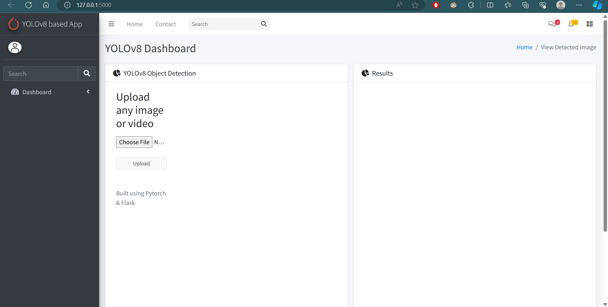

# Object Detection and Classification Project (YOLOv8 + PyTorch + CV2)

This project aims to provide a beginner-friendly introduction to object detection and classification using computer vision techniques. It presents a web application that can detect and classify objects in video streams or uploaded images.

## Table of Contents

- [Overview](#overview)
- [Features](#features)
- [Installation](#installation)
- [Usage](#usage)
  - [Web App Interface](#web-app-interface)
  - [Outputs](#outputs)
  <!-- - [Project Structure](#project-structure) -->
- [Evaluation](#evaluation)
- [Deliverables](#deliverables)
- [Optional Extensions](#optional-extensions)
- [Learning Outcomes](#learning-outcomes)
- [TO DO](#to-do)
- [Conclusion](#conclusion)

## Overview

The Object Detection and Classification in Video project focuses on implementing object detection and classification capabilities in a video stream. It is designed for beginners interested in learning computer vision concepts, particularly object detection and classification. The project involves selecting object classes, choosing a pre-trained model, implementing the application, and evaluating its performance.

## Features

- Object detection and classification in videos or images
- User-friendly web interface for uploading media and visualizing results
- Utilization of pre-trained models for object detection and classification

## Installation

To set up the project, follow these steps:

1. Clone the repository:

   ```bash
   git clone https://github.com/Haleshot/Object_Detection.git
   ```

2. Navigate to the project directory:

   ```bash
   cd Object_Detection
   ```

3. Create a virtual environment (optional but recommended):

   ```bash
   python -m venv env
   ```

4. Activate the virtual environment:
   - On Windows: `.\env\Scripts\activate`
   - On Unix or Linux or macOS: `source env/bin/activate`

5. Install the required packages:

   ```bash
   pip install -r requirements.txt
   ```

## Usage

To run the application, follow these steps:

1. Launch the Flask web application:

   ```bash
   python webapp.py
   ```

2. Open a web browser and navigate to `http://localhost:5000` to access the application.

3. Upload videos or images using the provided interface on the left side.

4. The results, including detected and classified objects, will be displayed on the right-side panel.

### Web App Interface

The web application features a user-friendly interface for uploading videos or images and visualizing the object detection and classification results.

<!-- #### Landing Page Screenshot

 -->

### Outputs

The following are the results obtained from testing the web application:

- Object detection and classification results are displayed in real-time on the right-side panel of the web application interface.
- For video uploads, the processed video with object detection overlays is shown dynamically.
- Object bounding boxes and labels are drawn around detected objects, providing visual feedback to the user.

#### Image Detection tests


#### Video Detection tests

<!-- <video src="assets/Video_Output_1.mp4" controls></video> -->


<!-- ### Project Structure

```
Object_Detection/
│
├── app/
│   ├── static/
│   │   └── css/
│   │       └── style.css
│   ├── templates/
│   │   └── index.html
│   └── webapp.py
│
├── uploads/
│
├── README.md
└── requirements.txt
``` -->

## Evaluation

After exploring the YOLOv8 documentation, I integrated the YOLOv8 model into a Flask-based dashboard application and tested it extensively with videos and images.

## Deliverables

1. Python code implementing the project with YOLOv8 integration into a Flask-based dashboard.
2. A short report summarizing the project, including chosen object classes, YOLOv8 model, implementation details using Flask, and evaluation results.

## Optional Extensions

- Implement object tracking functionality.
- Classify objects based on specific attributes (e.g., color, size).
- Integrate the application with real-world scenarios (e.g., traffic monitoring, people counting).

## Learning Outcomes

By working on this project, I have:

- Gained practical experience with object detection and classification techniques using YOLOv8.
- Understandood the workflow of building a computer vision application with a Flask-based dashboard.
- Explored the YOLOv8 pre-trained model and its capabilities.
- Experimented with different computer vision libraries and functionalities, including Flask and YOLOv8.


## To Do
- [x] Make Video Demos 

## Conclusion

After exploring the powerful YOLOv8 object detection model and integrating it into a user-friendly Flask web application, I’m thrilled with the results of this project. The ability to upload videos and images and witness real-time object detection and classification in action is truly exhilarating.

Throughout this journey, I’ve not only gained practical experience with cutting-edge computer vision techniques but also developed a deeper understanding of the workflow involved in building such applications. From choosing the right pre-trained model to designing an intuitive user interface, every step has been a valuable learning experience.

The YOLOv8 model’s robustness and accuracy, even in challenging lighting conditions and angles, have left me impressed. I’ve thoroughly tested the application with a diverse set of videos and images, and the results speak for themselves.

While this project has been a remarkable accomplishment, I’m excited about the potential for further enhancements. Implementing object tracking, attribute-based classification, and integrating the application with real-world scenarios like traffic monitoring or people counting are just a few of the possibilities that I’m eager to explore.

This project has reinforced my passion for computer vision and has motivated me to continue pushing the boundaries of what’s possible. I’m grateful for the opportunity to learn and grow, and I can’t wait to share my work with the community and inspire others to embark on their own computer vision journeys.
